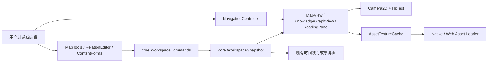

# worldedit 系统架构设计

版本0.2，待评审（0.2修订：矢量画布与栅格图层管线，预算指向契约阈值登记）；基线`b0955adcccd740d9b3b46cee1d0f503ad25f5257`。本设计保留Rust/egui作者工作台，新增地图展示和跨类型关联，不构建世界模拟引擎。

需求依据见[PRD](PRD.md)及[需求清单](https://github.com/ikzerok/worldline/blob/3f2255ef65a1da76dc34fed818f760cf9e8a8edc/docs/design/shared/REQUIREMENTS.md)；持久字段以[共同契约](https://github.com/ikzerok/worldline/blob/3f2255ef65a1da76dc34fed818f760cf9e8a8edc/spec/presentation.md)为准。事实来源R/E编号见[研究记录](https://github.com/ikzerok/worldline/blob/3f2255ef65a1da76dc34fed818f760cf9e8a8edc/docs/design/shared/RESEARCH.md)。

## 1. 当前基础

`WorldeditApp`已有Project、共享Snapshot、阅读目标/历史、图位置、表单状态和Vec<Project>撤销栈；当前Tab包括正文、时间线、事件关系图、人物、资料、Wiki、世界、源码和试玩。[R07]

`media.rs`目前把附件交给系统程序或浏览器下载；这不等于已有地图图片渲染。[R08] Cargo依赖egui/eframe 0.32范围；本次参考官方0.32.0 Scene实现，但实际锁定补丁版本必须在工程验证时核对。[R03,E01]

## 2. 组件职责



UI负责交互、纹理、布局、列表、导航和视觉反馈；core负责验证、查询、编辑事务、保存及引用。一个绘制函数只能读取数据并产生用户意图，不能边绘制边写世界资料。

## 3. 新模块建议

| 路径 | 职责 |
|---|---|
| `src/app/maps/mod.rs`（新） | 地图页、工具模式和UI状态 |
| `src/app/maps/canvas.rs`（新） | 分层绘制、标签和选择覆盖层 |
| `src/app/maps/camera.rs`（新） | 正逆变换、fit、指针中心zoom、视口裁剪 |
| `src/app/maps/tools.rs`（新） | 点/线/面编辑状态机，仅产生命令草稿 |
| `src/app/maps/hit_test.rs`（新） | 点/折线/区域命中和多候选 |
| `src/app/maps/inspector.rs`（新） | 标记说明、关联目标、图层和导航编辑 |
| `src/app/knowledge_graph.rs`（新） | 局部关联图、过滤和展开 |
| `src/app/relation_editor.rs`（新） | 明确关系创建/详情/删除 |
| `src/app/entities.rs`（新） | 通用内容和模板驱动表单 |
| `src/app/navigation.rs`（新） | 统一对象、地图、关系、源码定位 |
| `src/asset_cache.rs`（新） | 图片解码任务、纹理LRU和释放 |
| `src/app/review.rs`（新） | M4批注/提案/差异 |
| `src/app.rs` | 新Tab、状态容器和命令分发 |
| `src/app/reading.rs`,`search.rs`,`wiki.rs` | 扩展统一导航、反查和新实体 |
| `src/app/workspace.rs`,`browser.rs`,`archive.rs`,`web.rs` | 新元数据保存、浏览器往返和错误处理 |

M1可以先用少量文件实现，但模块边界要保持。不要在app.rs新增上千行地图/图像/合并代码。

## 4. 三种UI状态

### 4.1 WorkspaceModel

持有Project会话和Arc<WorkspaceSnapshot>；共享内容只能经过core命令修改。读资料、查询、画图都使用当前快照，不能在UI另建一份可独立修改的Object表。

### 4.2 PresentationDraft

拖拽起点、预览坐标、关系创建草稿、地图属性表单。它是未提交用户输入，必须携带文档基线。切换地图或有外部变化时，保留输入并提示，不直接覆盖原文件。

### 4.3 SessionUiState

当前地图、Camera2D、临时图层开关、搜索词、悬浮对象、访问历史、临时图布局。它默认属于个人，不触发Project.dirty。明确保存为共享视图才创建GraphView/MapPreset命令。

现有`version`与`PlayState.version`需要在接入时审查失效路径；不能用任何UI变化都增加的版本使地图拖拽重启试玩。新增presentation_generation与content_generation是分离依据，不是另造世界状态。

## 5. 地图绘制管线

### 5.1 栅格图层加载

1. 读取当前地图raster_layers所引用的asset摘要，经core安全文件访问获得字节。
2. 检查签名、格式、大小、方向/尺寸、像素乘法和预算；只接受首版PNG/JPEG。
3. 在本地工作线程或受限的Web任务中解码，结果携带asset内容hash与请求版本。
4. UI线程将解码像素交给纹理系统；创建纹理前再次检查设备最大尺寸。
5. 缓存以内容hash、显示变体和颜色处理选项为键；旧结果不覆盖已更换图层。
6. 当前地图不再使用时按LRU释放CPU/GPU副本；原素材仍在工作区。

候选image 0.25.8提供Limits，但max_alloc不是所有解码器都严格遵守，必须额外控制宽高/像素、任务并发和缓存预算。[E02] 预算按平台分档，单源见[共同契约阈值登记](https://github.com/ikzerok/worldline/blob/3f2255ef65a1da76dc34fed818f760cf9e8a8edc/spec/presentation.md)：桌面≤4096×4096且≤16,777,216像素，WASM默认≤2048×2048；桌面纹理缓存起始上限128MiB、Web64MiB，CPU解码缓存独立预算。预算含不了的纹理要拒绝或降级，不能先无条件解码。

WASM上的async函数不代表解码离开主线程。M1若没有Worker验证，必须用严格尺寸限制，并测量实际阻塞；M4再评审Worker或受控预览/瓦片加载，不能在架构中承诺不存在的后台能力。

EXIF方向与显示基准要在首次导入记录有效宽高；栅格图层的放置矩形属地图坐标空间，换图/移动图层不动图元。暂不支持可执行SVG、远程图片URL和任意外部文件引用；外部矢量文件导入不是本期目标，画布矢量图元为原生实现。

### 5.2 坐标与分层绘制

画布矢量原生：场景图持有图元（点标记、折线、多边形）与栅格图层。几何顶点先从地图归一化坐标转逻辑画布，再经Camera2D转为屏幕逻辑点；栅格图层按其放置矩形映射后同样经Camera2D。每个视图都有独立camera。栅格图层、面、线、点、文字、选择边框分层绘制，裁剪到画布区域。

图标/文字/热区在屏幕层保持可读尺寸；不要直接把整个文字UI无限缩放。官方Scene的变换实现可复用思路，是否直接包Scene由兼容原型决定。[E01]

滚轮/触控板缩放以指针下的地图点保持不动；zoom设上下限。高DPI只由渲染框架转换，计算逻辑坐标时不重复乘像素比。

### 5.3 命中测试

浏览命中先按可见图层筛选，锁定层仍可点击阅读；仅编辑控制点/拖拽候选排除锁定层。点按屏幕距离，线按最近线段距离，面按点在多边形内测试。重叠点优先弹候选列表或通过循环选择，不能永远只选最上层。

M1线性扫描500标记可作为起点；测量热点后再用网格/R树。需要注意不同图层的z顺序、编辑控制点优先级、屏幕固定热区和标签碰撞。几何形状无论命中何处都只选择展示项，不推导空间归属。

M4多边形首版支持简单无洞；凹形填充需要明确的三角剖分验证，不拿凸多边形填充接口冒充任意区域。可先提供轮廓显示，填充未支持时有说明。

## 6. 浏览与编辑工具状态机

```text
Browse
  点击标记 -> OpenObject / OpenMap
  空白拖动 -> 个人Pan
  滚轮 -> 个人Zoom

EditPresentation
  Idle -> BeginDrag(base_revision, placement_id, before)
  Dragging -> UpdatePreview(pointer)       # 不写Project
  Dragging -> CommitDrag(on pointer_up)    # 一次core命令
  Dragging -> Cancel(on Esc)               # 零写入
  Idle -> CreatePlacementDraft
```

标记拖拽与背景平移不能竞争同一个鼠标动作。浏览默认不允许移动标记；编辑状态下中键/空格拖动平移，左键用于标记操作。触屏或无中键设备应有显式平移工具。

Delete键作用于当前展示选择；删除资料必须从内容详情的明确菜单执行。Ctrl+Z在文本输入控件中优先处理本地文本撤销，其他情况下处理Project命令，避免按一次同时撤销两层。

外部刷新发生在Dragging期间，预览仍保留，但Commit检查基线失败；用户可取消或查看新旧位置后重新应用。不能仅因光标还按着就覆盖其他作者的修改。

## 7. 跨视图导航

统一意图：OpenObject(TargetRef)、OpenMap(MapId)、LocatePlacement、OpenRelation、OpenSource。原reading_target/history逐步由NavigationController管理，旧入口可以先适配，不一次重写全部界面。[R07]

对象摘要从当前快照读取；显示名变化自动更新未覆盖标签。导航历史存目标ID和个人视图状态，不存正文副本。地图链接可有循环和多入口；按点击进入，不在首次打开时递归加载所有子图。

定位隐藏层标记时显示“临时显示该图层”操作，不能写共享默认。找不到对象时给断链界面，不按显示名猜一个替代。

## 8. 世界关系图

数据来源仅为core的SemanticRelation查询；原事件关系图保留。默认局部一层、250节点/500边以内（阈值以[共同契约](https://github.com/ikzerok/worldline/blob/3f2255ef65a1da76dc34fed818f760cf9e8a8edc/spec/presentation.md)登记为准），可按对象类型、关系类型、方向和作者范围筛选。

布局器在UI层只接收节点/边和固定位置，输出显示坐标；M2先用确定性分组/环形/层级布局，复杂力导向不是前置。布局结果不进入内容索引。个人拖动不自动共享，明确保存后生成GraphViewDocument命令。

同端点多关系用平行边/可展开关系列表，不挤成一个“相关”。点击边查看类型、方向、说明和来源。正文提及作为单独可选图层，关键词命中不默认入网。

从节点连线发起关系创建时，打开类型和说明表单；取消不产生边。删除显示项不删SemanticRelation；真正删除需走core影响计划。

## 9. 内容与模板界面

新增EntityEditor统一处理类型、显示名、正文、字段、别名、素材和关联。优先复用现有资料阅读/属性编辑能力；现有人物表单不被强制替换为通用表单。

模板只提供字段/章节建议和原创中文问题；不覆盖已填写数据。历史事件、宗教观点、魔法规则和组织计划都是可编写资料，不增加执行按钮或参数求解器。

标注编辑器只编辑placement.annotation，不悄悄改entity.description。需要修改资料时明确切换到“编辑内容”，让审阅和Undo知道修改域。

## 10. 保存、错误与平台适配

所有持久修改经core会话。UI根据SaveReport显示成功、部分失败、外部冲突或需恢复。当前资料与未提交表单分别显示脏状态，避免“保存全部”只保存Project而让未提交表单误以为已保存。

NativePlatform提供文件选择、授权导入、安全读写和恢复UI；WebPlatform使用现有授权文件快照和ZIP，不声称磁盘实时同步。`archive.rs`沿用路径/文件数/展开字节限制，新注册JSON和未保存数据都来自core清单。[R09]

坏地图只读保留原文；缺栅格图层素材保留几何；坏正文不能锁死无关地图排版；断链允许重绑。异步完成消息携带asset hash和revision，过期任务丢弃其结果而不污染当前界面。

M4协作先采用文件/Git+提案。UI签名和“已审核”只是内容记录，不代表强访问控制。隐藏图层不能作为对文件接收者的保密机制。

## 11. 性能与测试

把camera、geometry、hit_test、layout、filter等做成不依赖窗口的纯函数测试。Project命令测试验证拖拽提交和Undo，GUI测试再验证手势绑定、焦点、DPI和多候选。

建议数据与阈值见PRD/TEST_PLAN。性能任务以真实测量为准：当前源码读取不构成性能证明。每帧只查询/绘制可见数据，不重建全工程索引，不全量解码图片，不克隆所有正文。

必须覆盖：坐标正逆变换；指针中心缩放不漂移；多次浏览零共享写入；一拖一次Undo；删标记不删资料；同名消歧；外部刷新中断拖拽；Web包超限；中文路径；长文本输入；旧试玩不被地图编辑重置。

## 12. 构建与发布策略

保持现有egui/eframe范围，原型首先在Cargo.lock实际版本编译；新增image依赖只开必要特性并更新锁文件。UI无需新增数据库依赖；JSON读写尽量由core处理，不让桌面和WASM各有一套地图序列化代码。

编辑器CI固定worldline兼容SHA，新增共享契约样例往返和桌面/WASM编译。当前CI已经包含Windows和WASM静态检查，但另一仓库checkout未固定ref，需在M0改进。[R12]

M1发布门槛是地图展示闭环和安全保存，不是大图、三维或云协作数量。后续阶段继续围绕作者内容展开，始终不接入世界演化。
